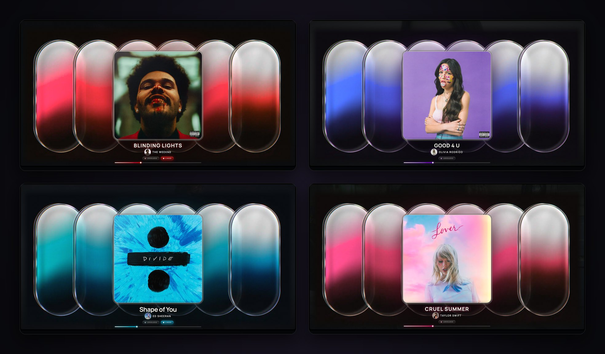
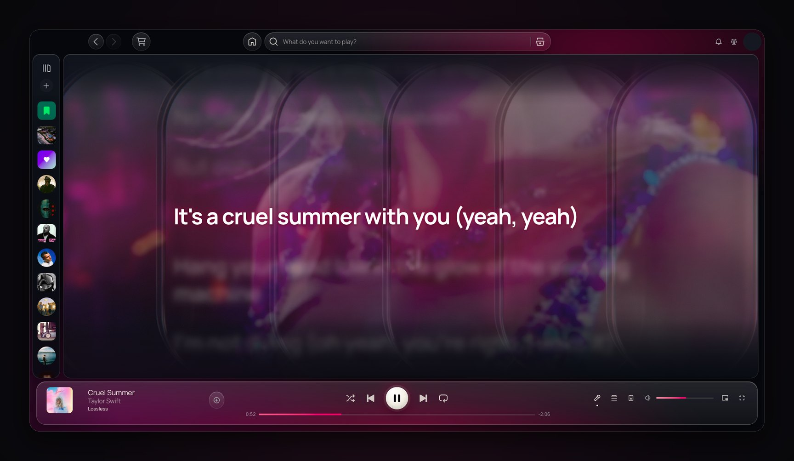
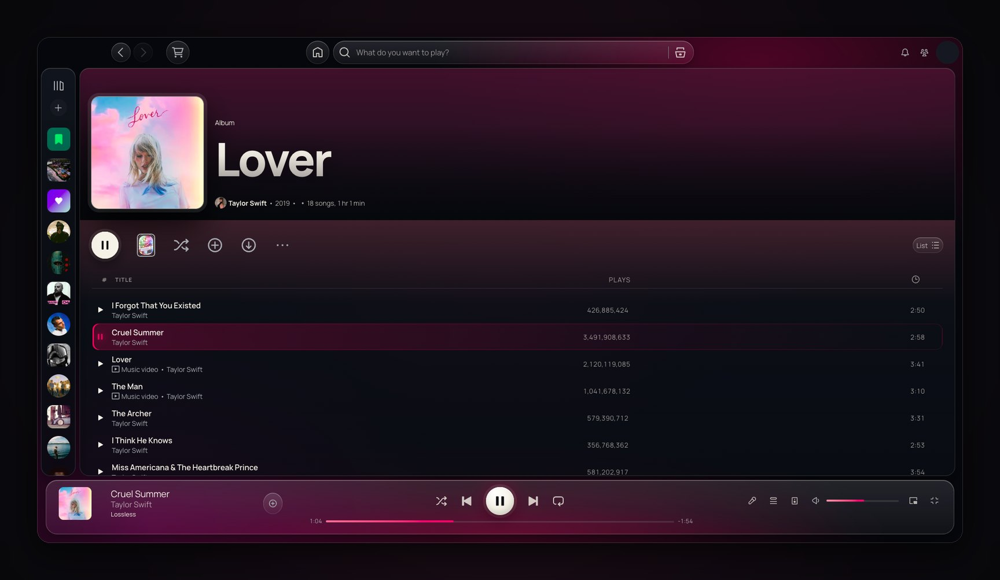
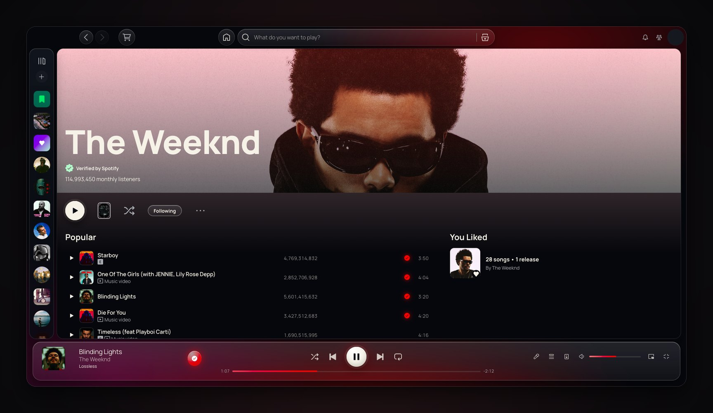
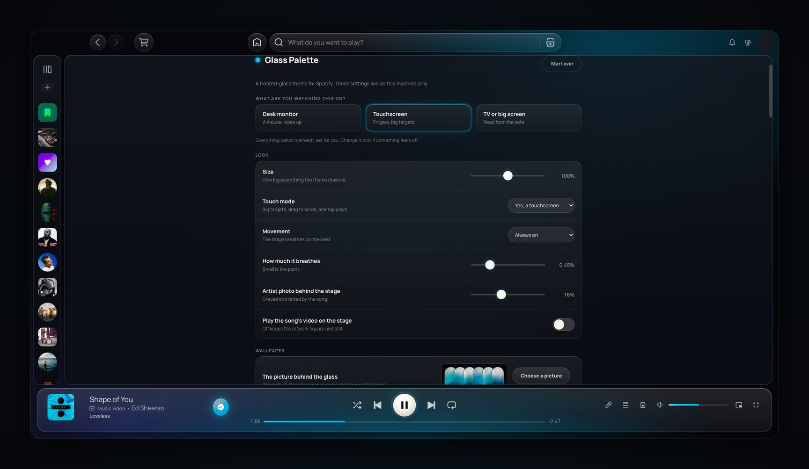
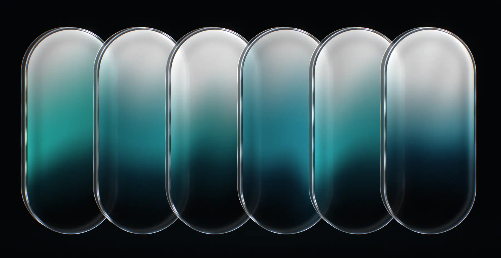

# Glass Palette

[](https://github.com/matthewwoolley4/glass-palette/actions/workflows/verify.yml)

A Spotify theme built to echo the "Glass Palette" wallpaper: frosted glass capsules holding the playing song's
colour on a near-black stage, warm-white rims, fine grain. The whole app is glass; the full-screen view is a stage
that recolours to every song and breathes on the beat; lyrics are letters cut from frosted glass that light up as
they are sung. Runs on [Spicetify](https://spicetify.app). Not a fork of anyone's theme.

Everything is configurable from a panel inside Spotify's own Settings page. Nothing else is required: no account,
no key, no service, and nothing to sign up for. It never contacts anything of mine. See
[Is this safe to install](#is-this-safe-to-install) for exactly what it does on your machine.



| | |
| --- | --- |
|  |  |
| **Lyrics** over the song's own Canvas video, the sung line lit and the rest softened. | **Albums and playlists** on glass, the playing row lit in the song's colour. |
|  |  |
| **The whole app** follows the song, not just full screen. | **Settings** inside Spotify: pick your screen, everything else is set for you. |

<sub>Real screenshots of the theme with its default wallpaper. Album art, artist photos and videos belong to their
owners and are shown only as Spotify shows them.</sub>

## Install from the Marketplace

If you already run Spicetify Marketplace, search it for **Glass Palette** and install it there, then restart
Spotify. The restart is not optional for this theme: it ships a `theme.js` (the song colour, the beat, the lyric
clock, the settings panel), and the Marketplace only loads a theme's JavaScript on the next launch.

## Install (one line)

- Windows (PowerShell): `iwr -useb https://raw.githubusercontent.com/matthewwoolley4/glass-palette/main/install-remote.ps1 | iex`
- macOS / Linux: `curl -fsSL https://raw.githubusercontent.com/matthewwoolley4/glass-palette/main/install-remote.sh | sh`

Then quit Spotify fully (Windows: tray icon > Quit) and open it again. The line installs Spicetify if you do not have it,
downloads this theme and applies it. Nothing else is needed: the built theme is in the box.

## Install by hand (three steps)

1. Install Spicetify once (official installer):
   - Windows (PowerShell): `iwr -useb https://raw.githubusercontent.com/spicetify/cli/main/install.ps1 | iex`
   - macOS / Linux: `curl -fsSL https://raw.githubusercontent.com/spicetify/cli/main/install.sh | sh`
2. Get this folder and run the installer inside it:
   - Windows: `powershell -ExecutionPolicy Bypass -File .\install.ps1`
   - macOS / Linux: `sh install.sh`
3. Quit Spotify fully (Windows: tray icon > Quit) and open it again.

Updating: pull the new version and run the same installer again. Removing: `spicetify config current_theme " "` then
`spicetify apply`, or `spicetify restore` for stock Spotify.

Python 3 is not required. The installer rebuilds from `src/` when it finds Python and otherwise installs the
prebuilt `dist/GlassPalette/`, which is the same build the Marketplace serves. You only need Python to change the
source and rebuild.

For the best sound on a Sonos or any Connect speaker, see [Sound](#sound): seven settings, each with the reason.

## If it does not work

**Spotify from the Microsoft Store cannot be themed.** Spicetify has to edit files inside Spotify's own folder, and
the Store keeps those read-only, so a Store install fails silently and looks like nothing happened. Uninstall it
(Settings > Apps > Installed apps), install the desktop app from
[spotify.com/download/windows](https://www.spotify.com/download/windows), open it once, and run the installer again.
The installer checks for this and says so. The Snap build on Linux has the same problem; use the `.deb` or the
Flatpak.

**Spotify updates itself and the theme disappears.** Every Spotify update overwrites the files Spicetify patched.
Put it back with one line:

```
spicetify backup apply
```

Then quit Spotify fully and open it again. Running the installer again does the same thing and is safe at any time.

**Nothing changed after installing.** Spotify has to be quit fully, not just closed: on Windows it keeps running in
the tray, so right-click the tray icon and pick Quit.

The theme is one self-contained folder: the Manrope font and the stage image are embedded at build time, so neither
is ever fetched while Spotify runs.

## Is this safe to install

Short version: it is CSS plus one JavaScript file, it talks only to Spotify's own servers using the token Spotify
already has, and every line of both is in this repository. Nothing is obfuscated, minified or fetched from a server
I control. If you would rather read it than trust it, that is the right instinct and the whole list is below.

### Check it yourself in one command

The files an install actually loads are the three in `dist/GlassPalette/`. They are committed, so that you do not
need a build step to use the theme, and that convenience is also the one place a theme could ship something that is
not in its source. So do not take my word for it:

```
python tools/verify.py
```

It rebuilds everything from `src/` into a temporary directory and compares the result to the committed files byte
for byte, then prints the SHA-256 of each. A **PASS** means the files you are about to install contain nothing that
is not in the source tree: no extra line, no different image, no injected anything. It needs only the Python
standard library, makes no network request, and writes nothing outside a temp directory. It exits non-zero on
failure, so you can put it in your own pipeline.

A second check, `python tools/leakcheck.py`, fails if any tracked file holds an API key or token, a private
network address, a home directory path, an email address or image metadata. The theme needs no keys of its own,
so there is nothing for it to find.

Both checks run on every push to this repository, so the **verify** badge at the top of this page is a standing
public statement about the current `main`, not a claim I am making in prose. The build is deterministic: the
wallpaper render is seeded, and the build itself is concatenation plus base64, so the same source always produces
identical bytes. That is what makes a byte comparison meaningful rather than approximate.

If you want to read rather than verify, the honest reading order is `src/runtime.js`, `src/settings.js`,
`src/touch.js` and `src/lights.js` (which does nothing unless you switch the lights on). Those four are the entire
program. Everything else is CSS.

**What Spicetify does, which is the bigger thing.** This theme is not a Spotify plugin in any official sense.
Spicetify works by editing files inside Spotify's own installation folder, which is why a Microsoft Store or Snap
copy cannot be themed. That is a real modification to the app, it is against Spotify's terms of use, and Spotify
does not support it. `spicetify restore` puts the original files back. Spicetify is a separate project from this
one, with its own maintainers and its own source: read it at
[github.com/spicetify/cli](https://github.com/spicetify/cli).

**What is actually in the box.**

| File | Format | What it can do |
| --- | --- | --- |
| `user.css` | Plain CSS | Changes how things look. CSS cannot read your account, make requests or run logic. The Manrope font and the stage image live inside it as base64 `data:` URIs, which is why the file is large. |
| `color.ini` | Plain text | A list of colours. |
| `theme.js` | Plain JavaScript | The part that can actually do things, so the part to read. It runs inside Spotify's window with the same access any Spicetify extension has. About 1100 lines, unminified, built by `build.py` purely by concatenating `src/runtime.js`, `src/settings.js`, `src/touch.js` and `src/lights.js`. Nothing is generated, minified or fetched. |

**One thing in `theme.js` looks alarming and is not.** The file is around 540 KB and one of its lines is roughly
half a megabyte long, which is exactly what obfuscated code looks like. It is not. `theme.js` carries a complete
copy of `user.css` as a single quoted string, because the Marketplace can strip a local theme's stylesheet link at
runtime, and the runtime re-injects that copy only when it finds no live `user.css`. That one long line is the
stylesheet, and most of its length is the wallpaper as a base64 `data:` URI. You can confirm it rather than take
my word for it: the string is ordinary CSS, and decoding the base64 gives the same `assets/wall.webp` that is
committed in this repository. Everything else in the file is normal, readable, line-broken JavaScript.

**Every network request the theme makes,** and there are no others:

- `i.scdn.co` to read the album art you are already looking at, so it can pick the song's colour and spot a
  flat-colour cover.
- `spclient.wg.spotify.com/color-lyrics/...` for lyric timings.
- `spclient.wg.spotify.com/audio-attributes/...` for the beat map.
- Spotify's own GraphQL service, through Spicetify's `Spicetify.GraphQL` (the same queries the app runs), for the
  artist's photographs and to ask whether the song has a Canvas.
- For a song with a Canvas, while lyrics are on screen only: `spclient.wg.spotify.com/manifests/...` to list the
  Canvas's versions, then its WebM pieces from `video-cf.spotifycdn.com` or `video-fa.scdn.co`, Spotify's video
  CDN. The theme checks each address against those hosts before fetching and stops at 8 MB. Settings > Lyrics
  turns it off, and then none of these requests happen.
- Only if you turn on **Send the song to your lights**: the song's colour, its beat map and where playback is, to
  the light server on `127.0.0.1`. The theme refuses any other address for this, so it cannot leave your computer.

All of these are Spotify's own endpoints, called with the token Spotify has already put in the page, for data the app
itself already uses. Nothing is sent anywhere else, there is no analytics, no telemetry, no update check and no
call home. The theme contains no `eval`, no `new Function`, no dynamic `import`, and no code fetched at runtime.
Your settings are `localStorage` keys on your own machine.

Two other web addresses appear in the files and neither is ever requested: `www.w3.org` is the XML namespace that
every inline SVG has to declare, and `github.com/matthewwoolley4/glass-palette` is the link at the foot of the
settings panel, which only opens if you click it. Searching the built files for `http` will turn up those two, the
Spotify addresses above, and `127.0.0.1`. That is the complete list.

The optional light server in the settings panel points at `127.0.0.1` on your own machine. The theme reads its
`/status` only while the settings panel is open, to show a green dot, and sends the lights nothing until you switch
that on. It is not required and the theme is complete without it.

**About the one-line install.** `curl ... | sh` and `iwr ... | iex` run a script off the internet without showing
it to you first. That is the normal way Spicetify is installed and it is what most projects do, but "everyone does
it" is not an argument. If you would rather look first, both scripts are short and do exactly three things:
install Spicetify if it is missing, download this repository, and run `install.sh` / `install.ps1` from it.

```
curl -fsSL https://raw.githubusercontent.com/matthewwoolley4/glass-palette/main/install-remote.sh -o install-remote.sh
less install-remote.sh      # read it, then:
sh install-remote.sh
```

Or skip the remote script entirely: clone or download the repository, read `install.sh`, and run it. Nothing
requires administrator or `sudo`, and nothing is installed outside Spicetify's own theme folder plus a copy of this
project in your home directory.

## What it does

**The full-screen stage.** Press full screen and the app becomes a concert poster: the artwork framed in glass on a
near-black ground, the song's own colour pooled behind it, the title set large and solid, the artist underneath, and
a hairline progress bar with a lit bead for a head. The wallpaper's capsules sit behind it all, tinted to the song's
hue. A track's Spotify Canvas video can be cropped into the artwork's exact square so nothing below it moves. That
is off by default, because Spotify rebuilds the full-screen layout around a Canvas and the still artwork is the
design; one setting turns it on.

**Colour that follows the song.** Every surface, glow and accent is driven by two custom properties, `--gs` and
`--gs2`, taken from Spotify's own full-screen colour when it publishes one and from the cover art's strongest hue
when it does not. There is no Spotify green anywhere in the theme.

**It breathes on the beat.** The theme reads the track's beat map (from Spotify's audio analysis, or from an
extension that publishes one) and swells the artwork and capsules a fraction of a percent on each beat. Small on
purpose: it should read as breathing, not bouncing. Size, strength and timing are all settings, and it honours the
system's reduce-motion switch unless you override it.

**Lyrics as frosted glass.** Lines are centred and cut from glass; the sung line lights up in the song's colour and
the lines around it fall away in depth of field. Nothing moves or resizes, so there is no jitter. The highlight runs
on the theme's own clock rather than Spotify's, because a Connect speaker plays ahead of the app and the words
otherwise trail the sound. The lead is a setting.

**A typographic voice per song.** Manrope throughout, but weight, case and letter spacing are chosen per track from
its colour, saturation and tempo, so a slow dark song and a bright fast one do not look the same.

**The whole app, not just full screen.** Glass panes for the nav bar, main view and right panel; a single wide search
pill; home shelves and cards on glass; track lists where the playing row is lit by the song from a bright left edge;
a wide dock whose progress bar runs the width of the window and whose "Playing on ..." label tucks into the corner.

**The liking moment.** Liking a song fires a calm ring of light from the button, a few glass sparks, and a flare
around the artwork's frame. Un-liking is deliberately quiet.

**Touch mode.** Bigger targets, no hover states, play controls always visible, and one tap plays a song instead of
two. A USB touchscreen reports no touch points at all on macOS, so it cannot be auto-detected; the setting says so.

**Settings inside Spotify.** A "Glass Palette" panel at the top of Spotify's own Settings page, with every knob, a
plain-language explanation of each, and a live connection test for the optional light server. Also reachable from
the profile menu. Settings are stored per machine, which is the point: a 27-inch monitor and a 15-inch touchscreen
want different sizes.

## Settings

Spotify > Settings > Glass Palette (or the profile menu > Glass Palette settings). Everything applies immediately.

| Setting | Default | What it does |
| --- | --- | --- |
| Size | 100% | Scales everything the theme draws: title, beads, lyrics, touch targets. A large desk monitor usually wants about 85%. |
| Touch mode | Work it out | Bigger targets, no hover states, one tap to play. Force it on for a USB touchscreen. |
| Motion | Follow the system | Whether the stage breathes on the beat, overriding the system's reduce-motion setting either way. |
| Beat swell | 0.45% | How far the artwork and capsules move on each beat. Zero turns it off. |
| Artist backdrop | 16% | A photo of the artist, greyed and tinted by the song, behind the full-screen stage. Zero turns it off. |
| Play the song's video on the stage | Off | Spotify's looping Canvas clip, cropped into the artwork's square. Off by default because Spotify rebuilds the whole full-screen layout around a Canvas and the stage has to fight it. The right panel keeps its video either way. |
| Lyrics lead | 350 ms | How far ahead of Spotify's clock the lines light. Raise it if words trail the sound on a Connect speaker. |
| Beat offset | 0 ms | Nudges the beat map if the swell feels early or late. |
| Colour | Follow the song | Or pick one colour, like a car's ambient light: the glass, the type and your lights all hold it. |
| Light server | `http://127.0.0.1:8197` | Optional. Where Glass Palette Lights (or your own light server) answers. |
| Send the song to your lights | Off | Sends the song's colour and beat to the light server on this computer. |
| Your lights | | The Govee lights the server found: tick the ones that follow the song, Flash one to see which it is. |

They are plain `localStorage` keys (`office-glass-*`) if you would rather set them from the console.

## The wallpaper



This is the default, [assets/wall.webp](assets/wall.webp): six frosted glass capsules on black, rendered from code
by [tools/render_wall.py](tools/render_wall.py) with no photograph in it, so it is covered by the same MIT licence
as the rest of the project. Use it as a desktop or phone wallpaper if you like it. In the theme it takes each song's
colour: the theme finds the picture's main colour when Spotify starts and turns every colour in it to the song's.

**Use your own.** Open Spotify's Settings (or **Glass Palette settings** in the profile menu), go to **Wallpaper**
and press **Choose a picture**. The preview beside the button is tinted live, so you can see it follow the song
before you go full screen. **Use the default** puts this one back, and so does **Start over**. Your picture is read
and shrunk in the page, kept in Spotify's local storage on that machine, and never uploaded anywhere.

Some pictures tint better than others:

- **One main colour** lands exactly on each song's colour. This is what the default is built for.
- **Several colours** all shift together, so it changes with every song but never matches one.
- **Greys, blacks and whites** carry no colour and stay as they are, so a mostly grey picture barely moves.

A wide picture suits the stage best; 1800 x 928 is its shape. To bake a picture into your own build instead, save
it as `assets/wall-raw.webp` and run `python build.py`. That file is gitignored, so it cannot be committed by
accident, and `python build.py --public` always goes back to the default.

## Optional services

Not needed. The theme is complete without it, and the settings panel says whether the light server is answering.

- **Room lights (Govee).** `extras/lights/` is Glass Palette Lights, a small server that puts the playing song's
  colour on Govee lights and lifts them on the beat. It finds the lights by itself over your own network: no Govee
  account, no API key, nothing in the cloud. Evenings run warmer and dimmer on their own (less blue light at
  night), and it never switches a light on or off. Three steps:
  1. In the Govee Home app, open each light's settings and turn on **LAN Control**.
  2. Install it (it needs [Node.js](https://nodejs.org) 18 or newer, and keeps itself running from login):
     - macOS / Linux: `curl -fsSL https://raw.githubusercontent.com/matthewwoolley4/glass-palette/main/extras/lights/install.sh | sh`
     - Windows: `iwr -useb https://raw.githubusercontent.com/matthewwoolley4/glass-palette/main/extras/lights/install.ps1 | iex`
  3. In Spotify: Settings > Glass Palette > turn on **Send the song to your lights**, press **Find lights**, and
     tick the ones you want. **Flash** blinks one so you can tell them apart.

  Only models with LAN Control work this way (most recent strips and bulbs). The server runs on the computer that
  runs Spotify, on the same network as the lights; the first time, your system may ask whether Node.js may use the
  local network, and it needs a yes. Its settings (brightness, beat depth, the night hours) are in
  `~/.config/glass-palette-lights/config.json` (Windows: `%APPDATA%\glass-palette-lights\config.json`). Remove it
  with `sh install.sh --remove` or `install.ps1 -Remove`. `node extras/lights/test.js` checks it against a stand-in
  light, so no real light is touched.

## What is in it

| File | What it is |
| --- | --- |
| `src/fullscreen.css` | The full-screen stage: black ground, framed artwork, title block, state beads, floating glass dock, progress hairline, Canvas clamp |
| `src/wall.css` | The stage image (the wallpaper's capsules) tinted to the song's hue, swelling with the beat, feathered edges, artist backdrop |
| `src/dock.css` | The dock folds away when idle and the stage takes the room; compact dock |
| `src/app.css` | Everything outside full screen: palette, glass panes, top bar, sticky headers, menus, popovers, Encore buttons and switches |
| `src/lists.css` | Home shelves, cards, track lists (playing row lit by the song), playlist headers, the dock's layout, search |
| `src/lyrics.css` + `src/glasstext.css` | Lyrics as frosted glass letters, the sung line lit in the song's colour, no movement or resizing |
| `src/voices.css` | Manrope throughout; per-song "voices" (weight, case, spacing) chosen from the song's colour |
| `src/like.css` | The liking moment: a calm ring, a few sparks, a glass toast |
| `src/details.css` | Beads with icons (Lossless, Liked, Paused), the artist portrait bead, side-panel padding |
| `src/touch.css` | Touchscreens: no sticky hover, no press-scale, 44 px targets |
| `src/settings.css` | The settings panel's own look |
| `src/runtime.js` | Song colour (`--gs`, `--gs2`, `--og-hue`), beat map, title block, idle detection, artist portrait, lyric clock, like celebration |
| `src/settings.js` | The settings panel and every stored preference |
| `src/touch.js` | What a finger needs and a mouse does not: drag to scroll with a glide, one tap plays a song, the arrow hides itself |
| `assets/wall.webp`, `fonts/` | Our rendered stage image and Manrope (embedded by the build) |
| `color.ini` | Spotify's base palette (scheme `Glass`) |
| `build.py` | Builds `dist/GlassPalette/` (`user.css`, `theme.js`, `color.ini`) |
| `install.ps1` / `install.sh` | Build, copy into Spicetify's Themes, set the config, apply |
| `install-remote.ps1` / `.sh` | The one-line installers (Spicetify if missing, download, install) |
| `tools/check.js`, `tools/render_wall.py` | Health check over the debug port; renders our own stage image |
| `tools/verify.py` | Rebuilds from `src/` and proves the committed `dist/` matches it byte for byte |
| `tools/leakcheck.py` | Fails on API keys, tokens, private addresses, home paths, emails or image metadata in any tracked file |
| `tools/compat.py` | After a Spotify update, lists any of the theme's hooks into Spotify that the update removed |
| `tools/release.py` | Pins the installers and the Marketplace manifest to one tagged release |
| `extras/lights/` | Glass Palette Lights: the song on Govee lights, its installers and its test |
| `manifest.json` | Spicetify Marketplace listing |

## Checking it is live

Start Spotify with a debug port (`Spotify.exe --remote-debugging-port=9223` on Windows,
`open -a Spotify --args --remote-debugging-port=9222` on macOS) and run `node tools/check.js`. It reports whether the
theme CSS and runtime are loaded, the font, the song colour, the beat map, motion state, UI scale, touch mode, frame
timing and any errors from the theme.

## Sound

The theme only shows the music; these settings decide how it sounds. None are required, and none are specific to
the theme. The short version, with the full list and every reason in [docs/sound.md](docs/sound.md):

| Where | Setting | Why |
| --- | --- | --- |
| Spotify | Streaming quality: Lossless | the best stream your plan allows; the theme's "Lossless" bead confirms it is live |
| Spotify | Auto adjust quality: Off | otherwise it drops to lossy quietly on a busy network |
| Spotify | Normalize volume: Off | its limiter flattens the loud and quiet parts of a song |
| Sonos | Trueplay: run it | corrects the speaker for the room; usually the biggest single change |
| Sonos | EQ flat, Loudness off for real listening | a flat start lets Trueplay work; Loudness adds bass meant for low volume |
| Sonos | Speech Enhancement and Night Sound: Off | both compress music the way they compress TV dialogue |
| Both | Play through Spotify Connect | the speaker streams from Spotify itself, so the computer's volume and Bluetooth are out of the chain |

## On a TV

Spicetify patches the Spotify **desktop** app. A TV's own Spotify (Tizen, webOS, Android TV, Apple TV) is a locked
app and cannot be themed, and casting only sends audio. What does work is a small computer behind the TV running
desktop Spotify full screen: a Raspberry Pi 5, a mini PC or an old laptop, with a phone as the remote over Connect.
The one-line installer covers Linux, so a Pi is about ten minutes of setup, and the theme already scales from a
single size setting.

## Releasing

`main` is where work happens; a tag is what people get. The one-line installers download a tagged release, and the
Marketplace manifest points user.css, color.ini and theme.js at that tag on jsdelivr, so a push to `main` reaches
nobody until a release is cut:

```
python tools/release.py v1.2.0
```

That sets the version in `manifest.json` and both one-line installers, rebuilds `dist/` with `--public`, and prints the
commit, tag and push commands; it never pushes by itself. Tags are never moved: a fix is the next version.
`python build.py --public` builds with our own rendered stage image (`tools/render_wall.py`); a personal
`assets/wall-raw.webp` is used by the plain build if present and is never committed.

## When Spotify updates

Spotify updates on its own, and an update can undo Spicetify or rename the parts of the app the theme styles. Three
things watch for that:

- **The install itself**, weekly and on every release: `.github/workflows/install-test.yml` takes clean macOS and Linux
  machines, installs Spotify, runs the one-liner unchanged and checks the theme is patched in. Each run records the
  Spotify and Spicetify versions it passed on.
- **The theme's hooks into Spotify**: `python tools/compat.py` checks every Spotify class name, test id and CSS
  variable the theme styles against Spotify's own app files, and names any that an update removed. Take a baseline
  on a day it looks right (`--baseline`); after that it only fails when something that worked has gone.
- **If Spotify updated and the theme is off**, run the one-line install again. It re-applies Spicetify and repairs
  the "backup is older than Spotify" error an update leaves behind.

## Licence

MIT. See `LICENSE`. The stage image is our own render (`tools/render_wall.py`). The embedded Manrope font is the
Manrope Project Authors', under the SIL Open Font Licence 1.1; the full licence text travels with the font in
`fonts/OFL.txt`, as the OFL requires.

## Rules the theme keeps

- Paint only. It never writes `--cinema-mode-bg-color-from` (Spotify's own full-screen colour; other tools read it).
- Animate transform and opacity only; no `backdrop-filter` or blend modes on anything that moves (steady 60 fps).
- Lyrics change colour only, in 0.18 s, labelled the same frame Spotify updates them.
- Nothing is targeted by Spotify's hashed class names. Those change with every Spotify build; the settings panel
  finds its place on the page structurally instead.
- The beat map: `window.__officeBeats = { id, tempo, beats: [{ t, s }] }` if an extension provides it, otherwise the
  theme fetches Spotify's audio analysis itself.
